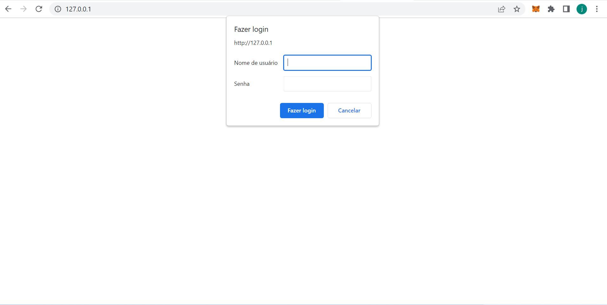
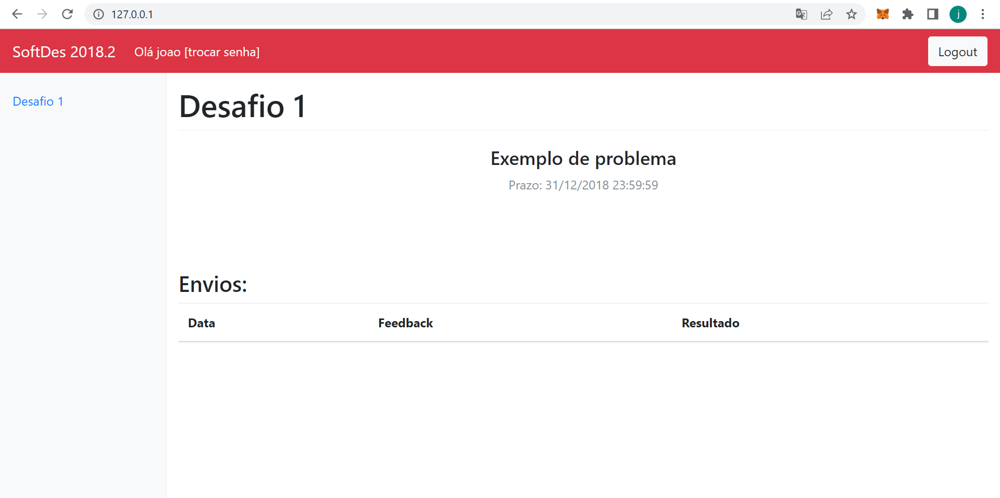

# Servidor de Desafios

## Sobre o Projeto:

O projeto Servidor de Desafios tem como principal objetivo ser um site de auxílio para alunos iniciantes em python terem um primeiro contato com a linguagem e aprenderem o básico.
É esperado que os alunos usem esse servidor como fonte de estudo e aprendizado.

## Software em funcionamento:

