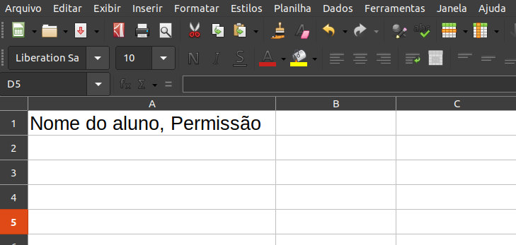
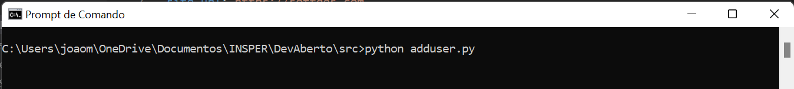

# Guia para professores

## Como adicionar um aluno no banco de dados ?

### Primeiro passo 
É necessário criar o arquivo users.csv, caso não exista. Para isso Siga os seguintes passos:

- Clique com o botão direito na pasta src
- Clique em adicionar novo arquivo
- Digite users.csv

### Segundo passo
Com o arquivo feito, popular o arquivo users.csv com o nome do aluno e sua permissão (ex: admin).
Para isso, abra o arquivo users.csv e faça a modificação necessária como na imagem abaixo

### Terceiro passo
Por fim, basta rodar o arquivo adduser.py que o aluno será adicionado no banco de dados.
